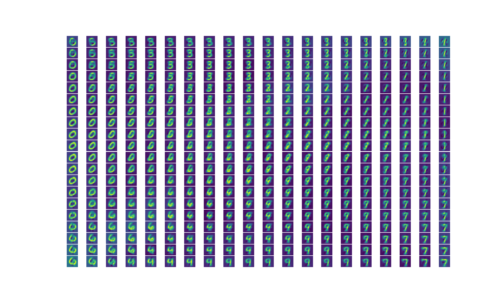
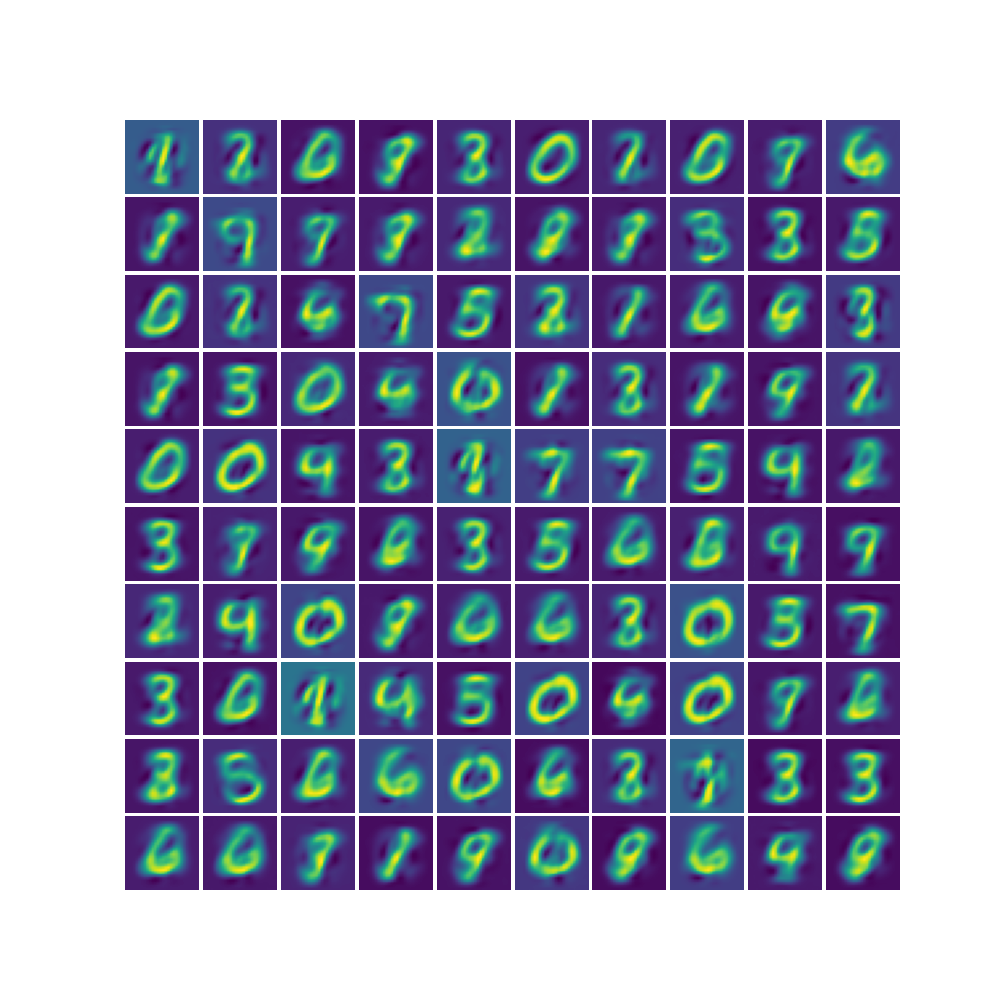
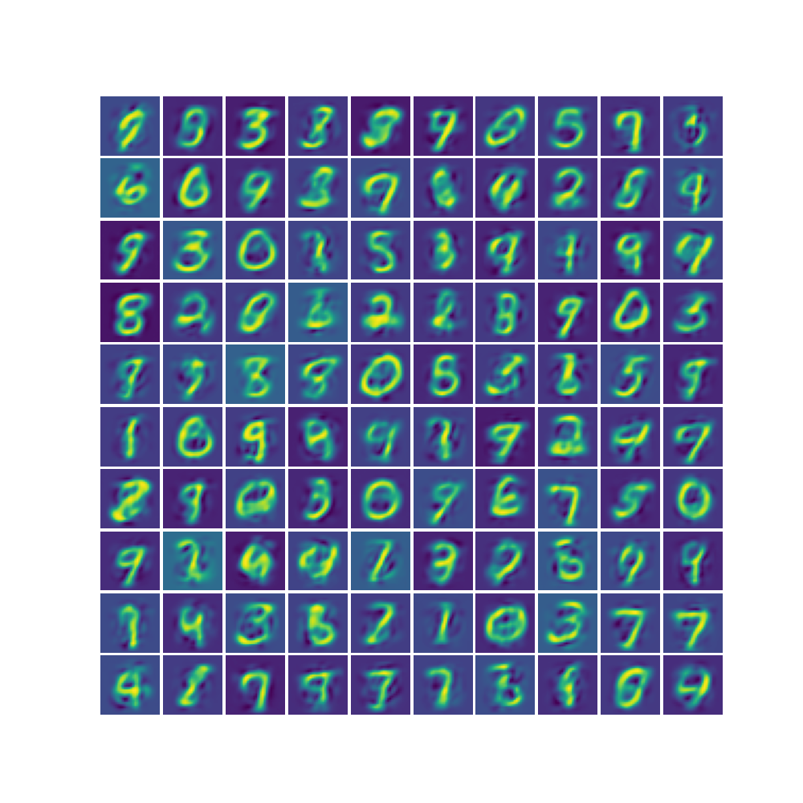

# Vanilla VAE

Variational Auto-Encoder (VAE) replication of paper [Auto-Encoding Variational Bayes](https://arxiv.org/abs/1312.6114), using Pytorch.

The VAE architecture follows section 3 and appendix C in the paper.

More specifically, VAE has an encoder and decoder. The encoder's architecture is: one MLP layer, followed by two linear heads, one for mean, one for variance.
The decoder consists just two linear layers.
Non-linearity function use `tanh`.

All linear layers are initialized by random sampling from `Normal(0, 0.01)`. 
Learning rate 0.001, batch size 100, and `L=1` samples per datapoint.

Below is the learned MNIST manifold when latent variable $z \in R^2$:

Random samples when latent variable $z \in R^2$:

Random samples when latent variable $z \in R^{20}$:

It looks to me $z \in R^20$ has better generation performance since the generated images have clearer images of 2 and 4. And the training loss is lower too.

